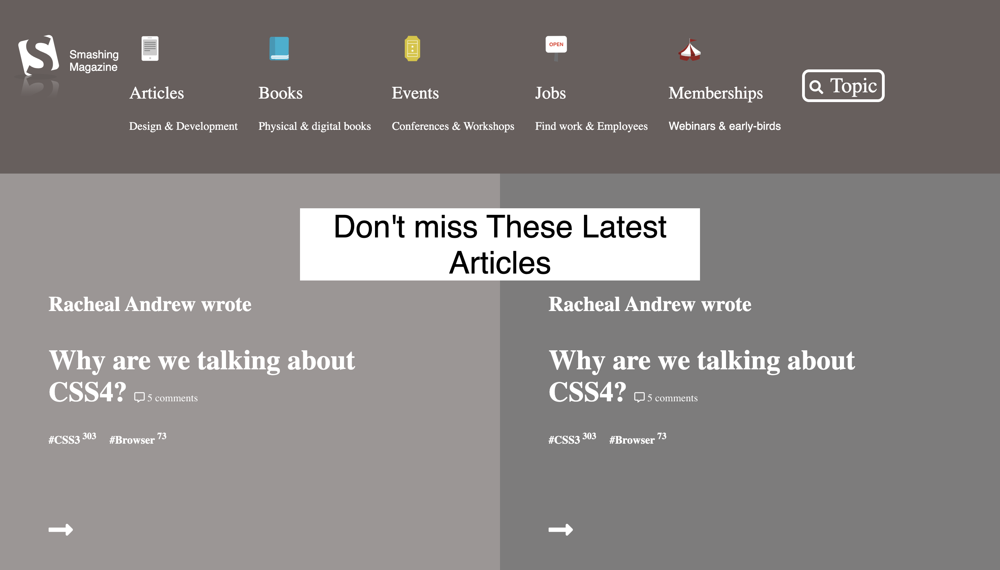

# Smashging Magazine

> Project Design & UX

> 

## Built With

- HTML &,
- CSS,

## Live Demo

[Live Demo Link](https://raw.githack.com/imahnama/Smashing-Magazine/smashing-magazine/index.html)

## Getting Started

To get a local copy up and running follow these simple example steps.

### Prerequisites

A browser of your choice preferrably Chrome.

### Setup

Fork this project to your local machine
Open the index.html file in any browser or edit using Visual Code or the preference IDE for web development

## Author

👤 **Rahma Halane**

- Github: [@Imahnama](https://github.com/imahnama)
- Twitter: [@halane_rahma](https://twitter.com/halane_rahma)
- Linkedin: [Rahmahalane](https://linkedin.com/Rahmahalane)

👤 **Phylis Chepchumba**

- Github: [@phlylis05](https://github.com/phlylis05)
- Linkedin: [PhylisChepchumba](https://linkedin.com/PhylisChepchumba)

## 🤝 Contributing

Contributions, issues and feature requests are all welcome!

Feel free to check the [issues/](https://github.com/imahnama/Smashing-Magazine/issues).

## Show your support

Give a ⭐️ if you like this project!!

## Acknowledgments

- Freecodecamp
- w3schools
- Font-awesome

## 📝 License

No License
